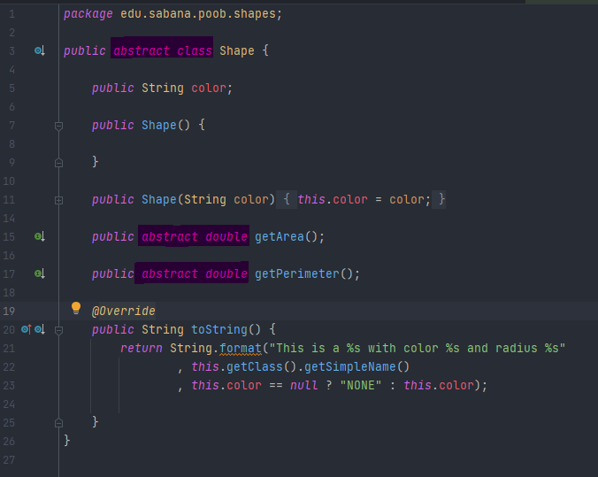
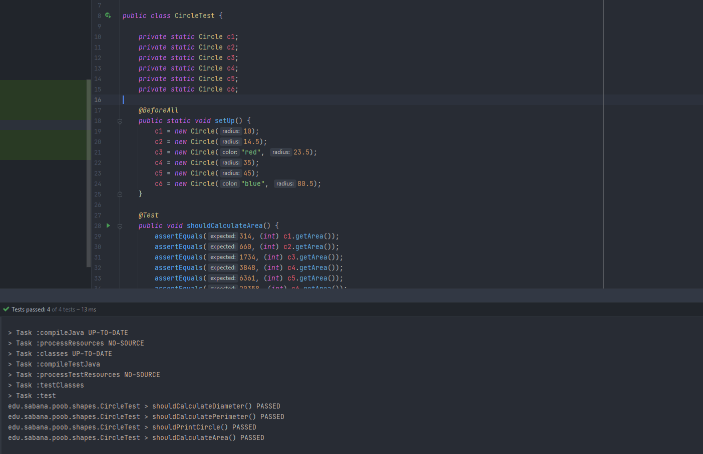
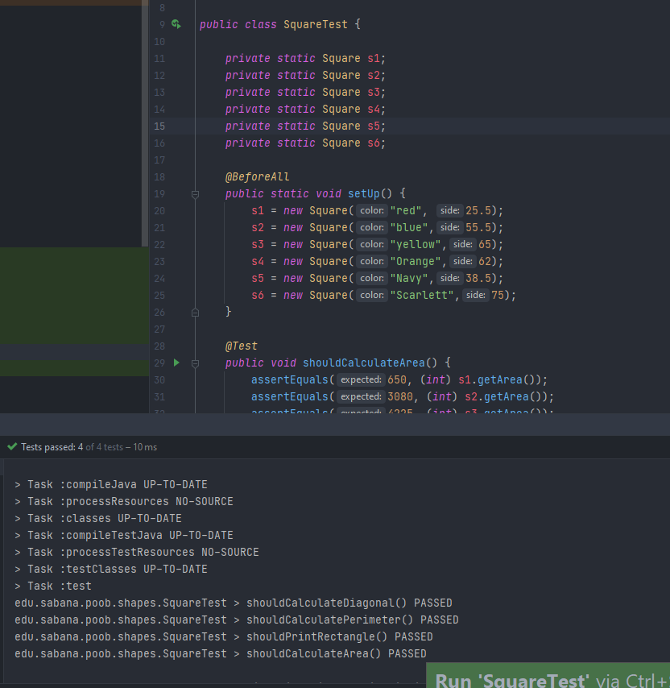
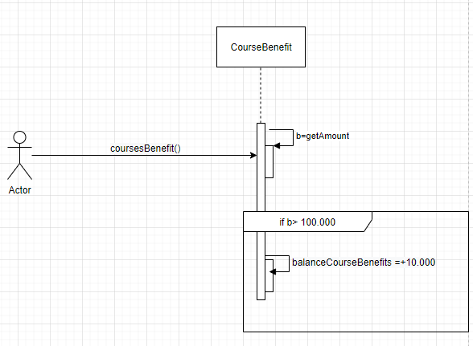

## PART I ##

**DESIGN**

PRUEBAS DE CODIGO:

**CIRCLETEST**

**TRIANGLETEST**

**RECTANGLETEST**

**SQUARETEST**

## PART II ## - SABANAPAYROLL

**LA CLASE EMPLOYEE PODRIA SER ABSTRACTA**

## PART III ##

BanckAccount

Checking 

**CheckingTest**

**SavingTest**

## PART IV ##

**DIAGRAMA DE SEQUENCIA**

**EVIDENCIA PRUEBAS**

## PART V ##

